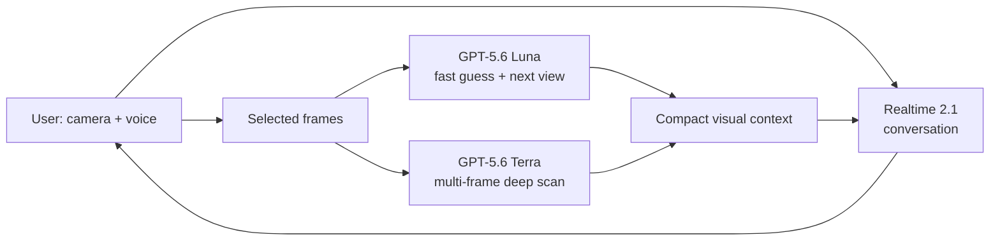

# Jardinly — OpenAI Build Week Extension

Jardinly is a live garden companion that listens, guides the camera, analyzes
multiple visual observations, and turns them into one calm, safe next action.

**Live demo:** https://jardinly-final-design-web-46886614931.us-central1.run.app

This is the public, extractable Build Week repository. Jardinly's pre-hackathon
product core is proprietary and remains in a separate private repository. This
repo contains the new AI orchestration contracts, runnable tests, architecture,
and the exact boundary used to keep the hackathon work separable.

## What we built

The user speaks naturally while showing a plant. Jardinly asks for useful views:
the whole plant, the problem area, and the pot or surrounding environment. A
fast visual pass gives provisional guidance; a deeper multi-frame pass produces
an evidence-backed rescue card and a 72-hour follow-up plan.



## How GPT-5.6 is used

| Model | Product role | Why |
|---|---|---|
| `gpt-5.6-luna` | Frame quality, provisional identity, visible issue, next camera angle | Fast enough for the guided capture loop |
| `gpt-5.6-terra` | Multi-frame identity, symptom evidence, differential causes, uncertainty, safe actions | Stronger reasoning for the final rescue card |
| `gpt-realtime-2.1` | Natural speech-to-speech companion | Keeps listening and speaking separate from slower visual analysis |

The app does not pretend Realtime continuously sees the camera. It samples
intentional frames, sends them to the appropriate GPT-5.6 visual deployment,
and gives the voice model only a compact text summary.

## How Codex was used

Codex with GPT-5.6 was a hands-on engineering collaborator, not a copywriting
add-on. It inspected the existing architecture, created a baseline, designed the
model split, implemented and tested the Azure adapters and orchestration,
diagnosed real production sessions, audited UX/accessibility, wrote the English
ADRs, committed attributable changes, built containers, deployed to GCP Cloud
Run, and verified production traffic and health.

See [the detailed attribution](docs/CODEX_AND_GPT56.md).

Model-family guidance: [OpenAI — Using GPT-5.6](https://developers.openai.com/api/docs/guides/latest-model.md).

## Repository boundary

Public Build Week code in this repo:

- `src/model-routing.ts` — Realtime/Luna/Terra deployment roles.
- `src/realtime-session.ts` — calm companion session, semantic VAD, voice, and
  far-field audio profile.
- `src/contracts.ts` — structured fast-guess and deep-scan evidence contracts.
- `src/orchestration.ts` — multi-view gating and compact voice context.
- `test/` — routing, multi-frame, graceful-degradation, and session tests.
- `docs/` — architecture, attribution, and Devpost handoff.

Private pre-hackathon core, intentionally excluded:

- authentication, user ownership, quotas, and persistence;
- proprietary plant records and care-domain implementation;
- production secrets and Azure/GCP credentials;
- unrelated product routes and historical source.

See [the architecture and extraction boundary](docs/ARCHITECTURE.md).

## Run the public contract tests

Requirements: Node.js 22.18+ and Corepack.

```bash
corepack pnpm install
corepack pnpm test
corepack pnpm typecheck
```

No API key is required for these contract tests. Production credentials are
bound through secret management and are never committed.

## Demo flow

1. Open **Live Scan** and describe the plant concern.
2. Show the whole plant; Luna checks the view and makes a provisional guess.
3. Show the affected leaf and pot; Jardinly requests only the missing evidence.
4. Terra combines the selected frames into an evidence-backed rescue card.
5. Save the card to **My Garden** and return after 72 hours for progress comparison.

## Safety and limitations

Jardinly provides plant-care guidance, not medical or veterinary diagnosis.
Confidence and uncertainty remain visible, risky claims are avoided, and the
first recommendation is intentionally reversible and plant-safe.

---

Built for OpenAI Build Week 2026. Engineering assistance and implementation
attribution: **GPT-5.6 / Codex**.
